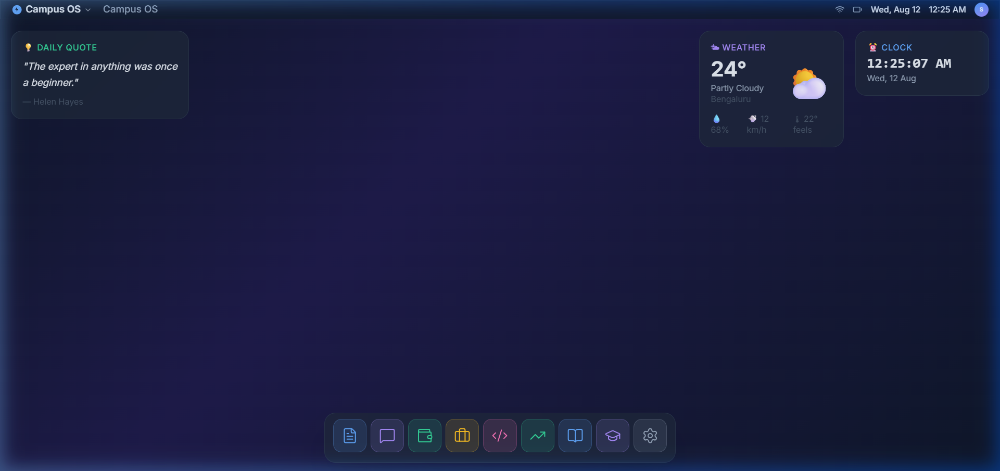

<div align="center">
  
  
  <h1>🎓 Campus OS</h1>
  <p><strong>A Unified, Browser-Based Operating System for Student Lifecycle Management</strong></p>

  <p>
    <a href="#features--native-apps">Apps</a> •
    <a href="#system-architecture">Architecture</a> •
    <a href="#installation-guide">Installation</a> •
    <a href="#tech-stack">Tech Stack</a>
  </p>
</div>

---

## 📖 Overview

**Campus OS** is a revolutionary web-based operating system designed to replicate a native desktop environment entirely within the browser. It unifies essential student lifecycle tools into a single, cohesive, glassmorphic workspace. From AI-driven interview preparation to a gamified learning engine, Campus OS transforms how students manage their education, careers, and finances.

---

## ✨ Features & Native Apps

Campus OS comes pre-loaded with a suite of integrated applications running in a custom window manager with dock navigation and a unified file system.

### 🧠 NovaMind (Learning Engine)
A personalized Learning & Career Intelligence Engine utilizing Bayesian Knowledge Tracing (BKT) to adapt to your skill gaps. Features an AI Tutor, career trajectory predictions, and a comprehensive gamification (Badges & XP) system.
<details>
<summary>View NovaMind in Action</summary>


</details>

### 💼 Interview Prep
AI-driven mock interviews with voice/text input, real-time evaluation, performance metrics, and actionable feedback to make you interview-ready.
<details>
<summary>View Interview Prep in Action</summary>


</details>

### 📄 Resume Analyzer
Upload your resume for ATS-style parsing, AI-based scoring, gap analysis, and a unified smart dashboard for placement readiness.
<details>
<summary>View Resume Analyzer in Action</summary>


</details>

### 🏦 FinSack (Finance & Expense Tracker)
A robust financial literacy suite featuring transaction logging, anomaly detection, AI budgeting, and investment simulations to build financial habits early.
<details>
<summary>View FinSack in Action</summary>


</details>

### 🔐 Unified Authentication
Seamless login flow powered by Clerk, ensuring secure access to all applications and persisting session states across the OS ecosystem.
<details>
<summary>View Auth Flow in Action</summary>


</details>

---

## 🏛️ System Architecture

Campus OS is built on a highly modular, 5-layer architecture designed for scalability, low latency, and heavy AI integration.

### **Layer 1 — Desktop Shell & UI**
- **Window Manager:** Drag, resize, minimize, maximize, and z-index management.
- **Dock Navigation & Widgets:** App launching, global spotlight search, smart widgets (Weather, To-do), and OS-level notifications.

### **Layer 2 — Native Application Modules**
- Resume Analyzer • Interview Prep • FinSack (Expense Tracker) • Placement Portal • Code Review • Finance Edu • NovaMind (Learning Engine)

### **Layer 3 — Shared Services & Intelligence**
- **NOVA AI:** Agentic assistant powered by Gemini 1.5 Flash for context-aware tool calling and hyper-specific guidance.
- **RAG Pipeline:** Document ingestion, MiniLM vector embeddings, and Pinecone vector search for grounded AI responses.
- **Unified Auth & Progression:** Role-based access control (Clerk) and centralized gamification (XP, badges, leaderboards).

### **Layer 4 — Backend API Services**
- Built on **Next.js API Route Handlers** (RESTful architecture).
- Dedicated micro-services for Code Scanning, Resume Parsing, Interview Audio, Finance Insights, and Learning Paths.

### **Layer 5 — Data Layer & External APIs**
- **Databases:** MongoDB Atlas (Persistent Storage), Pinecone (Vector DB), Upstash Redis (Session/Response Caching).
- **External Integrations:** Cloudinary (Media), Gemini 1.5 (AI), Alpha Vantage (Live Market Data), YouTube Data API.

---

## 🚀 Installation Guide

Get Campus OS up and running on your local machine in minutes.

### Prerequisites
- Node.js 18.x or higher
- npm, pnpm, or yarn
- Git

### 1. Clone the repository
```bash
git clone https://github.com/only-vikas/campus-os.git
cd campus-os
```

### 2. Install dependencies
```bash
npm install
# or
yarn install
```

### 3. Set up Environment Variables
Duplicate the example environment file and add your API keys:
```bash
cp .env.example .env.local
```
*Required Keys:*
- `NEXT_PUBLIC_CLERK_PUBLISHABLE_KEY` & `CLERK_SECRET_KEY`
- `GEMINI_API_KEY` (Google AI Studio)
- `PINECONE_API_KEY`
- `MONGODB_URI`

### 4. Run the Development Server
```bash
npm run dev
# or
yarn dev
```
Open [http://localhost:3000](http://localhost:3000) in your browser to view the OS.

---

## 🛠️ Tech Stack

- **Frontend:** Next.js 14 (App Router), React, TypeScript, Tailwind CSS, Framer Motion
- **Backend:** Next.js API Routes, Node.js
- **Database & Caching:** MongoDB, Redis (Upstash), Pinecone
- **Authentication:** Clerk
- **AI & LLM:** Google Gemini 1.5 Flash, Ollama (Local Fallback)

---

## 🤝 Contribution Guidelines

We welcome contributions from the community to make Campus OS even better! 

1. **Fork the Project**
2. **Create your Feature Branch:** `git checkout -b feature/AmazingFeature`
3. **Commit your Changes:** `git commit -m 'Add some AmazingFeature'`
4. **Push to the Branch:** `git push origin feature/AmazingFeature`
5. **Open a Pull Request**

*Please ensure your code follows the existing style guidelines and runs without errors in the development environment.*

---

## 📜 License

This project is licensed under the MIT License - see the `LICENSE` file for details.

---
<p align="center">
  Built with ❤️ for students.
</p>
