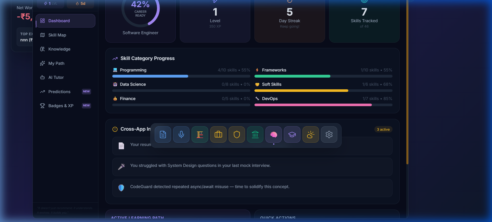
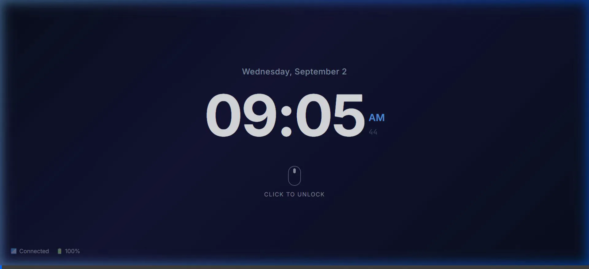
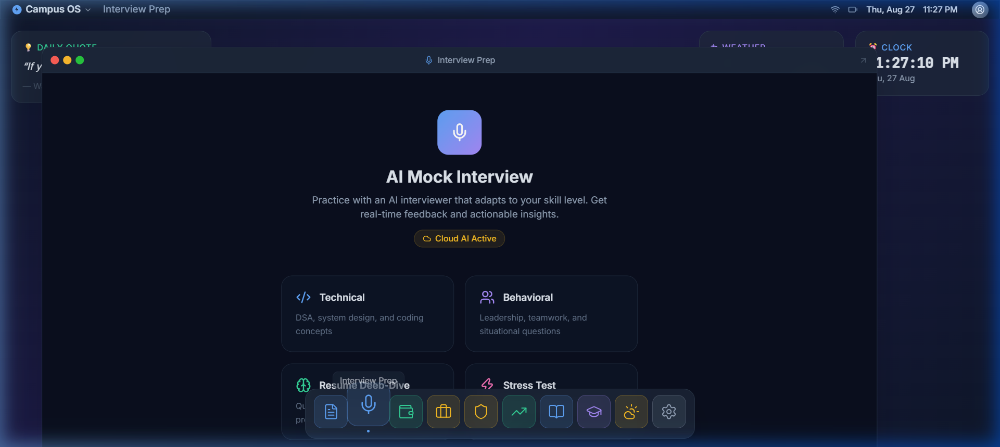
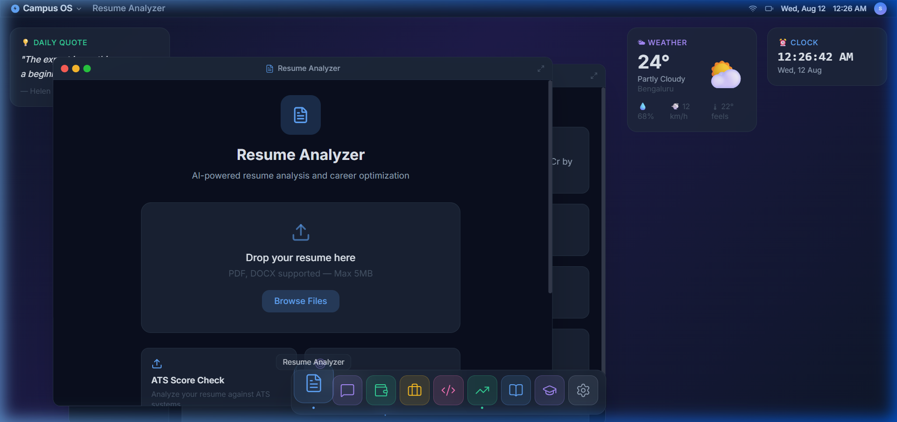
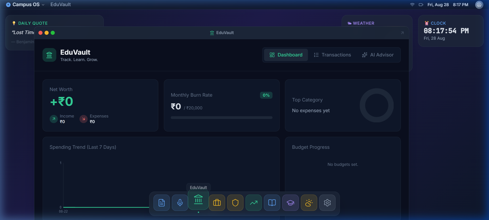
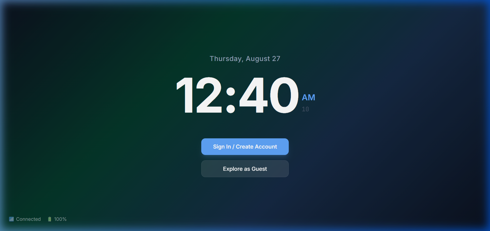
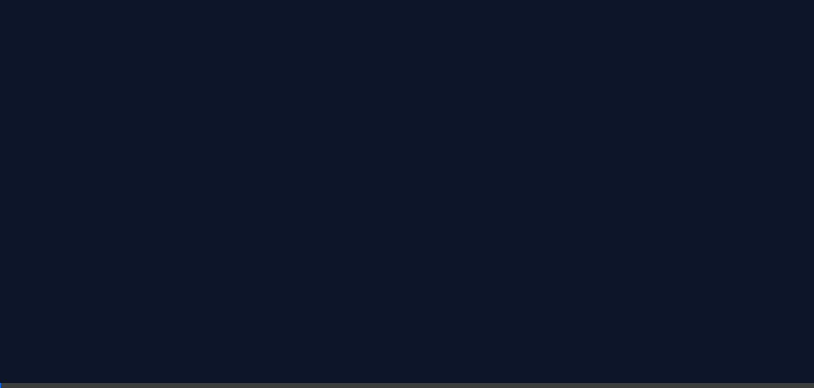

<div align="center">
  <h1>🎓 Campus OS</h1>
  <p><strong>A Unified, Browser-Based Operating System for Student Lifecycle Management</strong></p>
  <p>
    <a href="#showcase">Showcase</a> •
    <a href="#features--native-apps">Apps</a> •
    <a href="#system-architecture">Architecture</a> •
    <a href="#installation-guide">Installation</a> •
    <a href="#tech-stack">Tech Stack</a>
  </p>
</div>

---

## 📖 Overview

Campus OS recreates a native desktop experience inside the browser and unifies key student tools — learning, career preparation, finance, and campus services — under a single windowed UI with [...]

This README has been reorganized so each feature is explained and immediately followed by its screenshots and captions. All original screenshots are preserved and placed where they provide the bes[...]

---

## 🎯 Showcase

A quick visual tour of Campus OS — untrimmed screenshots captured from the running UI. Each image is the original capture and is shown here to give an immediate sense of the overall environment [...]

### Main Desktop Shell & Window Manager


*The main Campus OS desktop with windowed applications, taskbar, and system UI elements.*

---

### Dashboard & System Overview


*Dashboard view showing widgets, quick access apps, and system status information.*

---

### Full-Screen Application View


*An application in full-screen mode with expanded workspace and detailed content area.*

---

### Dock & Application Launcher


*The dock at the bottom displaying active apps, pinned shortcuts, and quick launch menu.*

---

### Multi-Window Workspace


*Multiple windows open simultaneously, demonstrating window management and multitasking capabilities.*

---

### Application Details & Notifications


*Detailed view of an application interface with notification panel and system alerts.*

---

### Global Search & Navigation


*Global search functionality in action, showing unified search across all apps and services.*

---

## ✨ Features & Native Apps

Each app section below contains a short description, key capabilities, and the preserved screenshots/demo media that show the feature in action.

### 🧠 NovaMind — Learning Engine

NovaMind is a personalized learning and career intelligence engine that uses Bayesian Knowledge Tracing (BKT) to adapt content to each student's gaps. It provides an AI tutor, mastery tracking, an[...]

Key capabilities:
- Adaptive practice and quiz generation (BKT-powered)
- Personalized career trajectory predictions and learning milestones
- Progress dashboard with XP, badges, and mastery metrics

Screenshots & demo:





Caption: NovaMind dashboard showing mastery progress, recommended practice items, and predicted career trajectories.

---

### 💼 Interview Prep

AI-driven mock interviews with voice and text input, real-time evaluation, and structured feedback so students can rapidly improve interviewing skills.

Key capabilities:
- Live voice/text mock interviews with role-specific question sets
- Real-time performance metrics (confidence, fluency, topic coverage)
- Actionable feedback and focused practice recommendations

Screenshots & demo:




Caption: Interview Prep UI with a mock interview panel and performance analytics.

---

### 📄 Resume Analyzer

Upload your resume for ATS-style parsing, automated scoring, gap analysis, and AI suggestions to improve structure and keyword matching for roles.

Key capabilities:
- Automatic section extraction (Experience, Education, Skills)
- ATS score and suggestions tuned to job descriptions
- Export cleaned and rescored resume versions

Screenshots:



Caption: Resume Analyzer view showing parsed sections, ATS score, and suggested edits.

---

### 🏦 FinSack — Finance & Expense Tracker

FinSack is a financial literacy and expense-tracking suite for students with anomaly detection and AI-driven budgeting guidance.

Key capabilities:
- Transaction logging, categorization and visualization
- Anomaly detection with alerts for unusual spending
- Budget recommendations and simple investment simulations for learning

Screenshots & demo:




Caption: FinSack dashboard with transaction summary, budget recommendations, and savings visualizations.

---

### 🔐 Unified Authentication

Campus OS uses Clerk to provide secure, centralized authentication and session management across the entire OS.

Key capabilities:
- Single sign-on across all apps in the OS
- Role-based access control and persistent session state
- Support for email, OAuth providers, and SSO where configured

Screenshots & demo:





Caption: Login and auth flow demonstrating how Clerk integrates into the OS.

---

## 🏛️ System Architecture

Campus OS is structured as a modular 5-layer architecture for scalability and AI integration:

- Layer 1 — Desktop Shell & UI: Window manager, dock, global search, and widgets
- Layer 2 — Native Application Modules: NovaMind, Resume Analyzer, Interview Prep, FinSack, Placement Portal, Code Review
- Layer 3 — Shared Services & Intelligence: NOVA AI assistant, RAG pipeline (MiniLM embeddings → Pinecone), unified auth & gamification
- Layer 4 — Backend API Services: Next.js API route handlers and microservices for parsing, audio, and finance insights
- Layer 5 — Data Layer & External APIs: MongoDB Atlas, Pinecone, Upstash Redis, Cloudinary, Gemini 1.5, Alpha Vantage, YouTube Data API

Further architecture diagrams and contributor notes live in the docs/ folder.

---

## 🚀 Installation Guide

Prerequisites:
- Node.js 18.x or higher
- npm, pnpm, or yarn
- Git

1. Clone the repository

```bash
git clone https://github.com/only-vikas/campus-os.git
cd campus-os
```

2. Install dependencies

```bash
npm install
# or
yarn install
```

3. Set up Environment Variables

```bash
cp .env.example .env.local
```

Required keys:
- NEXT_PUBLIC_CLERK_PUBLISHABLE_KEY & CLERK_SECRET_KEY
- GEMINI_API_KEY (Google AI Studio)
- PINECONE_API_KEY
- MONGODB_URI

4. Run the development server

```bash
npm run dev
# or
yarn dev
```

Open http://localhost:3000 in your browser to view the OS.

---

## 🛠️ Tech Stack

- Frontend: Next.js 14 (App Router), React, TypeScript, Tailwind CSS, Framer Motion
- Backend: Next.js API Routes, Node.js
- Database & Caching: MongoDB, Redis (Upstash), Pinecone
- Authentication: Clerk
- AI & LLM: Google Gemini 1.5 Flash, Ollama (local fallback)

---

## 🤝 Contribution Guidelines

1. Fork the project
2. Create your feature branch: `git checkout -b feature/AmazingFeature`
3. Commit your changes: `git commit -m "Add some AmazingFeature"`
4. Push to your branch: `git push origin feature/AmazingFeature`
5. Open a Pull Request

Please follow existing code style and ensure the project runs in the dev environment before opening a PR.

---

## 📜 License

This project is licensed under the MIT License — see the `LICENSE` file for details.

---

<p align="center">Built with ❤️ for students.</p>
